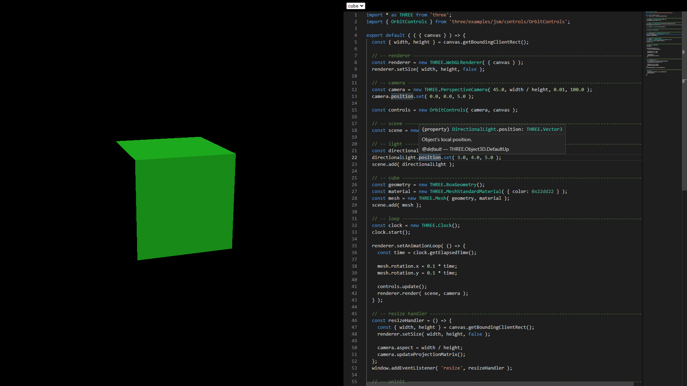

# three-playground



### Features

- Three.js and several related modules are installed
- Monaco Editor with type definitions enabled (it's TypeScript mode actually)
- `Ctrl+S` (or `Ctrl+R`) to run instantly

### Currently Available Modules

- [three](https://github.com/mrdoob/three.js)
- [lil-gui](https://github.com/georgealways/lil-gui)
- [camera-controls](https://github.com/yomotsu/camera-controls)
- [@pixiv/three-vrm](https://github.com/pixiv/three-vrm)
- [webgl-lint](https://github.com/greggman/webgl-lint)
- [webgl-memory](https://github.com/greggman/webgl-memory)

### Build

```sh
npm i
npm run build
```
